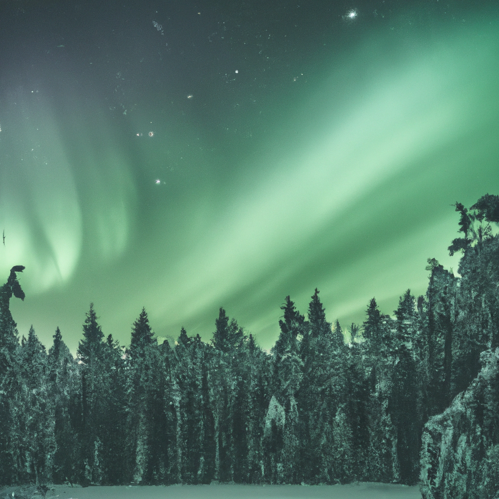
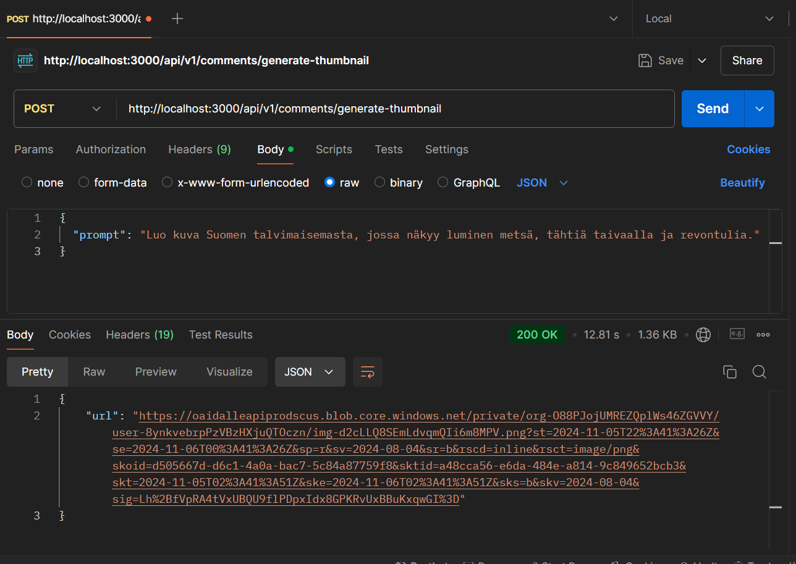

# Image Generator

This project is an Image Generator that creates images based on text prompts. It uses the OpenAI API to generate images tailored to specific descriptions.

### Prompts Used

"Luo kuva Suomen talvimaisemasta, jossa näkyy luminen metsä, tähtiä taivaalla ja revontulia."

### Example Images

- 

- **Postman result**
- 

## Setup and Usage

1. Clone the repository.
2. Run `npm install` to install dependencies.
3. Start the server using `npm start`.
4. Use Postman or any API client to send a POST request to `http://localhost:3000/api/v1/comments/generate-thumbnail`.
   - **Request Body**:
     ```json
     {
       "prompt": "Your description here"
     }
     ```

---
